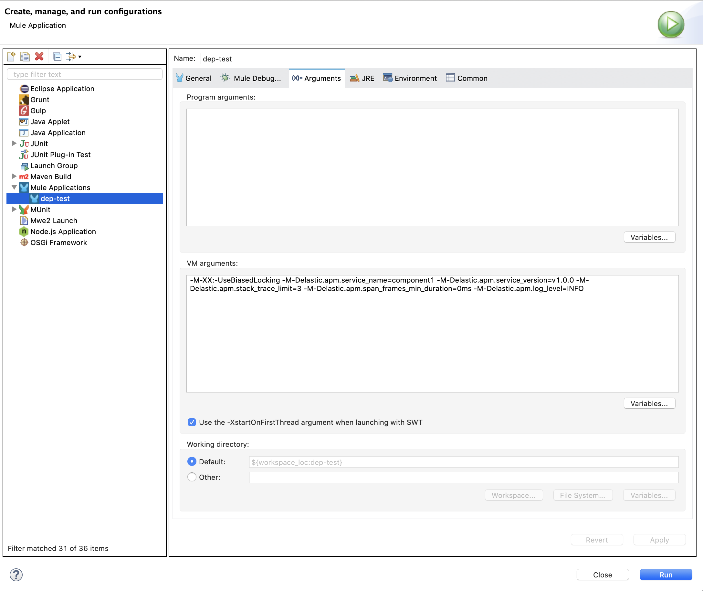
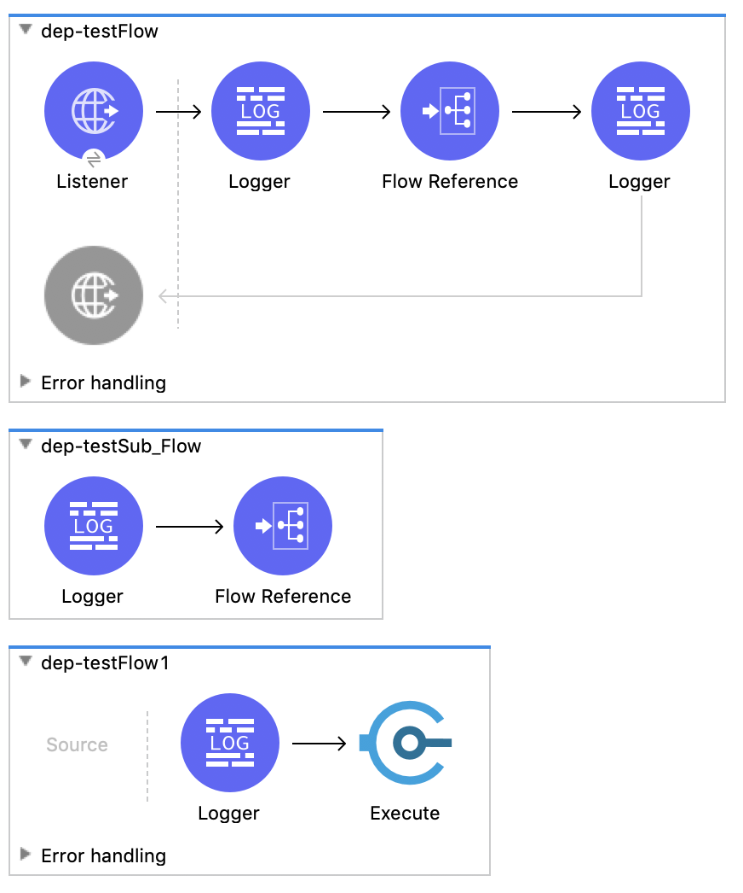
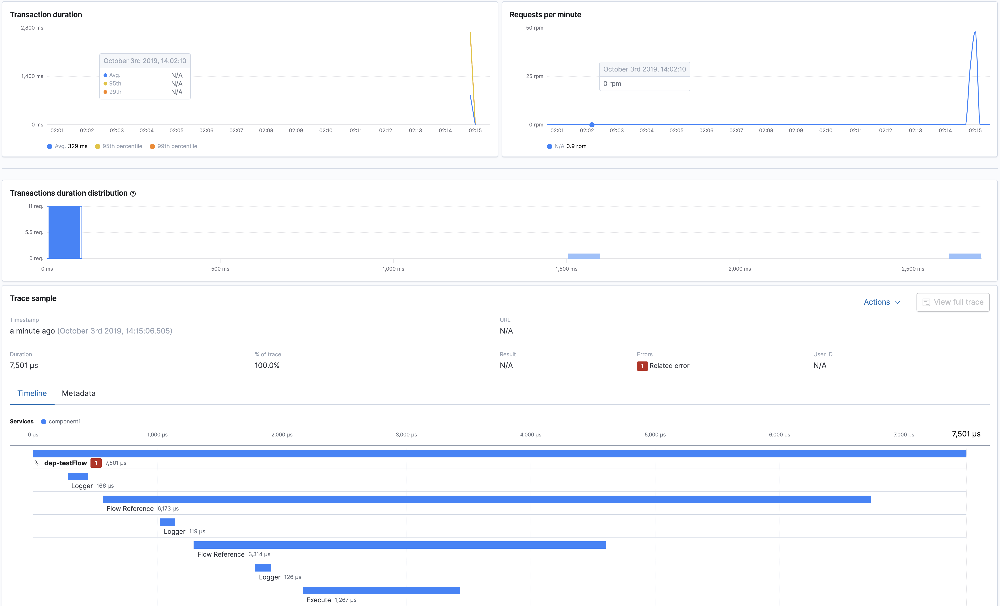
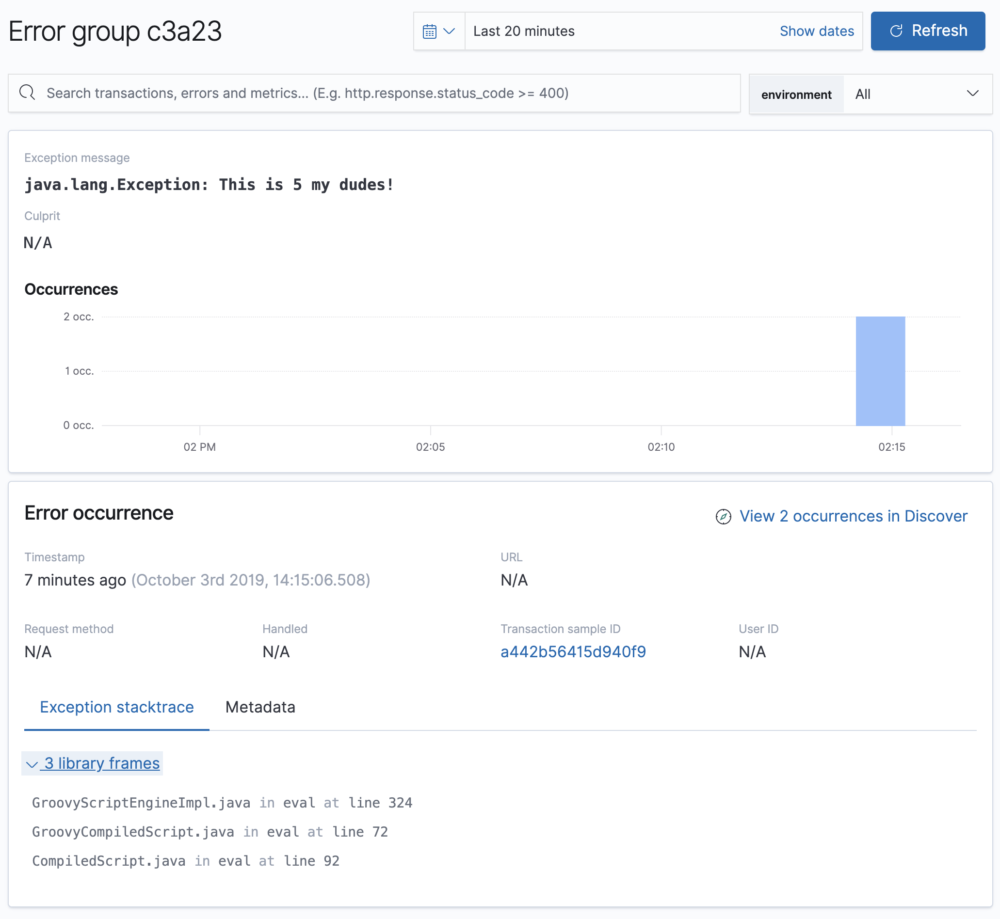
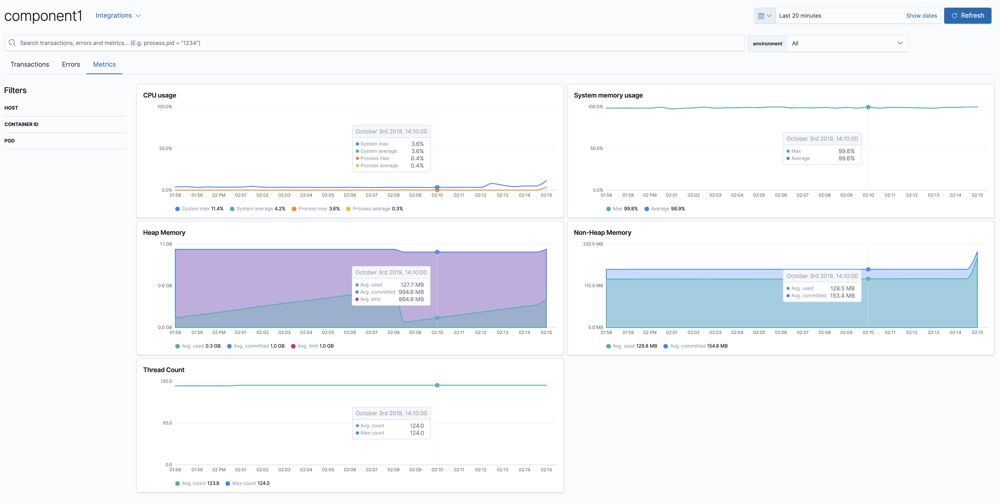

# Elastic APM agent for Mule 4.x
## important note
Until version 1, the agent is considered work in progress, where some of the features may be broken or missing. Please feel free to download the agent, raise issues, test and contribute to make it better.
### Work in progress
These items are still missing and still need to be developed:
* ~Distributed tracing with HTTP.~
* Generic distributed tracing for non-HTTP protocols.
* Capturing flow variables and properties in the flow.
* ~Documentation.~
* Mule domain projects support.

## Overview
The agent allows tracking the timing of Mule flow steps executions and captures data, metrics and exceptions raised in Mule flows. It is included as Maven dependency and is instantiated in the flow. The data collected by the agent is stored in Elasticsearch and can be visualised in Kibana in a way compatible with the rest of Elastic APM stack. This allows Mule 4 components to be monitored and profiled alongside other technologies in [Elastic APM](https://www.elastic.co/products/apm). The agent is built using [Elastic Java APM agent](https://www.elastic.co/guide/en/apm/agent/java/1.x/index.html) and is compatible with Java APM agent [configuration options](https://www.elastic.co/guide/en/apm/agent/java/1.x/configuration.html).
## Installation
Download the latest jar from the [Releases](https://github.com/michaelhyatt/elastic-apm-mule4-agent/releases) and install it using Maven. Make sure to populate the right values for `PATH_TO_JAR` and `AGENT_VERSION`.
```bash
mvn install:install-file -Dfile=$PATH_TO_JAR -DgroupId=co.elastic.apm -DartifactId=apm-mule3-agent -Dversion=$AGENT_VERSION -Dpackaging=jar
```
## Setup in Mule
### Add dependency in Maven
Add the following dependency to Mule project's `pom.xml` file. You can use `elastic.mule4.apm.agent` property as the version to match the version of the agent downloaded and installed previously in the `properties` section of Mule project `pom.xml` file.
```xml
<dependency>
  <groupId>co.elastic.apm</groupId>
  <artifactId>mule4-agent</artifactId>
  <version>${elastic.mule4.apm.agent}</version>
</dependency>
```
### Top-level Mule flow
In the top level flow, add the follwing import statement to initialise the agent. The id warning can be ignored, or the id can be regenerated.
```xml
<import file="tracer.xml"  doc:name="Import" doc:id="3cd0c923-2ca2-4173-a2e8-c43380f03b3c" />
```
## Configuration
The agent configuration is done using system properties with all the properties used in [Elastic Java APM agent configuration](https://www.elastic.co/guide/en/apm/agent/java/current/config-reference-properties-file.html).
### Command line
When running Mule through the command line, use the following format to configure the APM agent.
```
-M-Delastic.apm.server_urls=http://localhost:8200 \
-M-Delastic.apm.service_name=component1 \
-M-Delastic.apm.service_version=v1.0.0 \
-M-Delastic.apm.stack_trace_limit=15 \
-M-Delastic.apm.span_frames_min_duration=0ms \
-M-Delastic.apm.log_level=INFO
```
It is also possible to use property file based configuration by specifying the location of the properties file in `elastic.apm.config_file` option.
### Anypoint Studio
Pass the configuraion parameters in command line arguments section of `Run Configurations...` dialog, as per the image below.

## Distributed tracing support
### HTTP listener
If the incoming HTTP request contains the standard `elastic-apm-traceparent` HTTP header, the top level transaction created for the top level flow will be made part of the overall distributed trace and will be annotated with the same `trace.id` as the rest of the transactions belonging to the same trace.
### HTTP requester
Default Mule HTTP requesters will propagate the trace information and the outgoing HTTP requests will contain the `elastic-apm-traceparent` HTTP header automatically.
### Manual trace context propagation
The APM agent will create a flow variable called `elastic-apm-traceparent` that can be used in the flow to propagate trace context for non-HTTP protocols used by other Mule connectors, such as JMS, Kafka, etc. This flow variable will need to be mapped into a specific data field of the transport protocol, such as JMS header, to be propagated to another external component that participate in the distributed trace.
## Test projects
### distributed-tracing
Project illustrating distributed tracing between two Mule components using `docker` and `docker-compose` with self-contained Elastic Stack (Elasticsearch, Kibana, APM server, heartbeat).
#### Running the project
TBD
#### Screenshots
TBD
### dep-test
#### Mule flow
The `dep-test` folder in this repo contains a sample test project configured to work with Elastic APM agent for Mule 4 and containing the flow below. Note the last logger in the topmost flow didn't run due to exception thrown by the Execute step denoted as red square.

#### The above flow should produce APM transaction similar to this:

#### The agent also captures exceptions thrown in Mule:

#### Metrics
Elastic Java APM agent also captures JVM metrics, so all the Mule JVM metrics collected by the agent are there as well:

