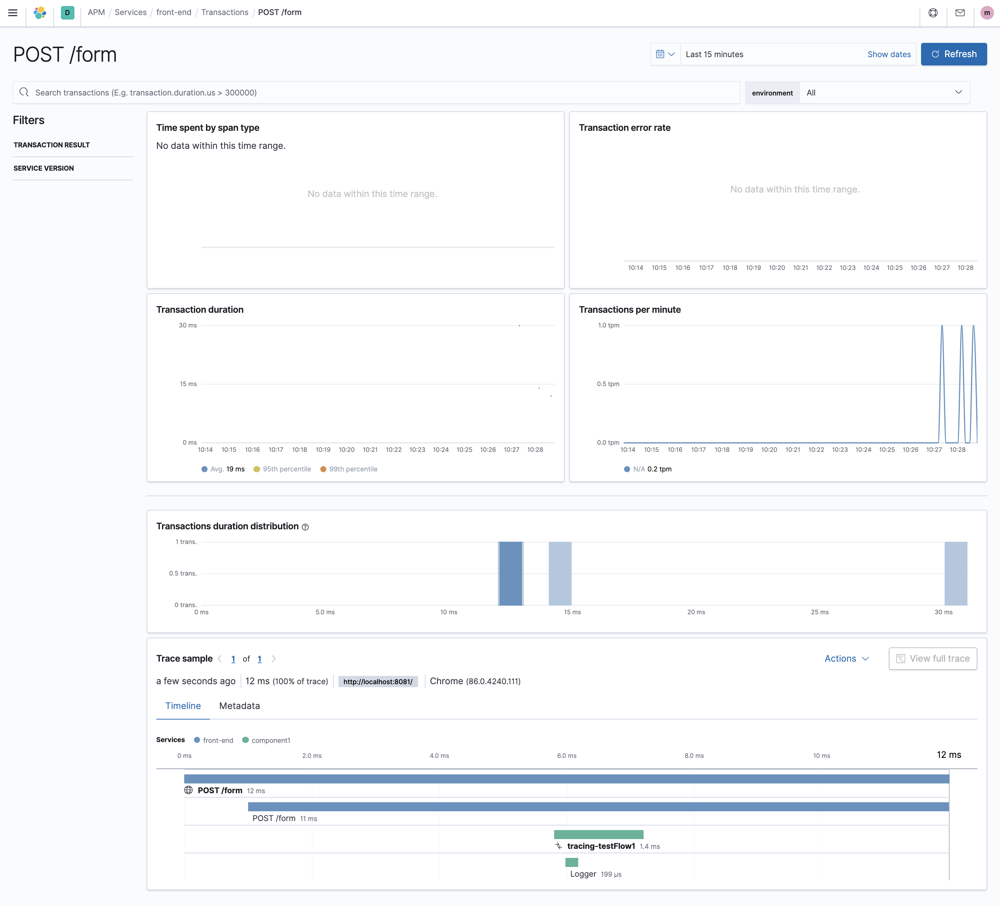

# Tracing test

## Intro
This Mule project runs as a Mule engine instrumented with the Mule APM agent and it serves a HTML page with Elastic RUM agent that both participate in a distributed trace. The RUM agent in the browser starts a transaction and sends a `traceparent` header containing the `trace.id` back to the Mule runtime that records its own transaction using the sent `trace.id` which results in a complete trace populated in Kibana APM UI:


## How to run
Start the Mule project with the following additional parameters to initialise the APM agent:
```
-M-Delastic.apm.server_urls=https://XXXXX.elastic-cloud.com -M-Delastic.apm.secret_token=YYYYYY -M-Delastic.apm.service_name=component1 -M-Delastic.apm.service_version=v1.0.0 -M-Delastic.apm.log_level=INFO
```

Open the browser at http://localhost:8081 and press the `Press me` button a couple of times.
